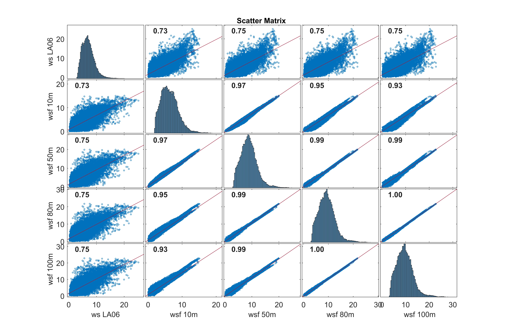
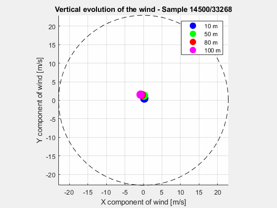
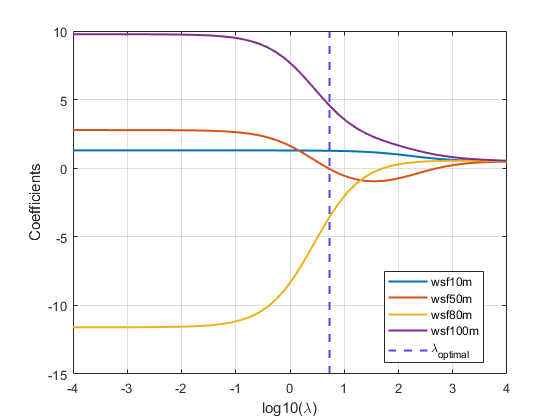
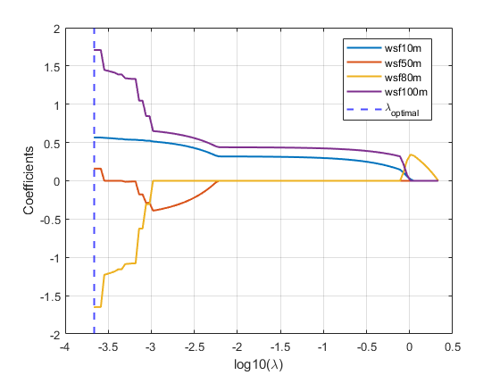
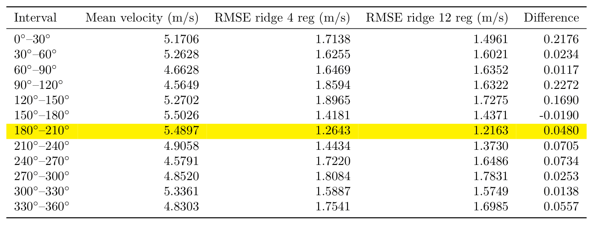

# Wind Speed Forecasting for Wind Turbines Using Regression Techniques

## 1. Introduction

This project investigates the prediction of wind speed measurements at a wind turbine using regression techniques and meteorological forecast variables.

The main objective is to estimate the wind speed measured by the turbine anemometer by exploiting weather forecast information available at different heights.

The project focuses on:
- exploratory data analysis;
- identification of relationships among meteorological variables;
- development and comparison of regression models;
- feature engineering based on wind direction information.

---

# 2. Problem Formulation

The regression problem is defined as the estimation of the measured wind speed at the turbine location using forecasted meteorological variables.

## Input Variables

The input features include:

- Forecasted wind speed variables (wsf):
  - wsf_10M
  - wsf_50M
  - wsf_80M
  - wsf_100M

- Forecasted wind direction variables (wdf):
  - wdf_10M
  - wdf_50M
  - wdf_80M
  - wdf_100M

## Target Variable

The target variable is:

- Wind speed measured by the turbine LA06 anemometer: wsLA06

---

# 3. Exploratory Data Analysis

## 3.1 Correlation Analysis

A preliminary analysis was performed to investigate the relationships among the available meteorological variables.

The scatter matrix highlights a strong correlation among wind speed variables measured at different heights.

The high correlation between input variables indicates the presence of multicollinearity.

This can negatively affect Ordinary Least Squares regression, since highly correlated predictors may lead to unstable coefficient estimates.

For this reason, regularized regression techniques, particularly Ridge Regression, were considered as suitable approaches for this problem.

---

# 4. Wind Direction Analysis

## 4.1 Vertical Wind Direction Profile

The variation of wind direction across different heights was investigated to evaluate the presence of a vertical wind direction profile.

Initially, a possible vertical directional profile was considered, where wind direction could progressively change with increasing altitude due to atmospheric effects.

The following animation shows the evolution of wind speed and wind direction at the four different heights over time.

The animation shows that, although wind speed changes significantly across different heights, wind direction values remain relatively aligned over time.

The wind direction points tend to move together, maintaining approximately the same angular orientation and remaining close to a common line passing through the origin of the polar representation.

This suggests that, in the analyzed dataset, the vertical variation of wind direction is limited compared to the variation of wind speed. Therefore, wind direction was considered as a global directional feature rather than as a separate vertical profile.

---

# 5. Regression Models

Three regression approaches were developed and compared:

## Least Squares (LS)

The baseline model was implemented using Ordinary Least Squares regression.

## Ridge Regression

Ridge Regression was introduced to handle multicollinearity among meteorological variables by adding an L2 regularization term.

The regularization parameter λ was optimized through validation.

The coefficient path shows the effect of increasing λ on the regression coefficients.

## Lasso Regression

The regularization parameter λ was tuned to identify the optimal trade-off between model complexity and prediction error.

The coefficient path highlights how Lasso progressively shrinks some coefficients towards zero as regularization increases.

---

# 6. Directional Performance Analysis

The prediction performance of the Ridge regression model was analyzed according to wind direction sectors.

The analysis showed that the prediction error was not uniform across all wind directions.

Some wind direction sectors resulted in lower RMSE values, suggesting that wind direction contains additional information useful for improving prediction accuracy.

This observation motivated the inclusion of wind direction features in the final model.

---

# 7. Feature Engineering

Wind direction is a circular variable, meaning that values close to 0° and 360° represent similar directions.

To correctly represent this property, wind direction variables were transformed using sine and cosine encoding:

- sin(θ)
- cos(θ)

These transformed features were included together with wind speed variables to build an extended Ridge Regression model.

This approach allows the model to exploit directional information while preserving the circular nature of the variable.

---

# 8. Model Evaluation

The regression models were evaluated using:

- Root Mean Square Error (RMSE)
- Coefficient of determination (R²)
- Normalized RMSE (NRMSE)

## Model Comparison

| Model | RMSE (m/s) | R² | Mean normalized RMSE |
|------|------------|----|-------|
| Least Squares | 1.581 | 0.533 | 0.316 |
| Ridge Regression | 1.577 | 0.536 | 0.315 |
| Lasso Regression | 1.577 | 0.533 | 0.315 |
| Ridge Regression (extended features) | 1.563 | 0.558 | 0.307 |

The comparison shows that regularization provides a slight improvement over the Least Squares baseline. Ridge Regression was selected as the preferred approach because of its ability to handle multicollinearity among highly correlated meteorological variables.

The inclusion of wind direction features through sine and cosine encoding further improved the final Ridge Regression model.

---

# 9. Final Model Results

The final Ridge Regression model, including wind direction features encoded through sine and cosine transformations (12 regressors in total), achieved:

- **RMSE:** 1.56 m/s
- **R²:** 0.56
- **NRMSE:** 8% (normalized by the target range)

The model is able to capture the main variations of wind speed while effectively handling the correlation among meteorological variables.

---

# 10. Conclusions

This project demonstrated the application of regression techniques for wind speed forecasting in a wind turbine context.

The main findings are:

- Wind speed variables at different heights are strongly correlated.
- Ridge Regression is a suitable approach for handling multicollinearity.
- Wind direction provides additional predictive information when properly encoded.
- Feature engineering based on circular variables improves the representation of meteorological data.

Future improvements could include:
- comparison with machine learning models such as Random Forest and Gradient Boosting;
- time-series forecasting approaches;
- implementation of the complete pipeline in Python.
